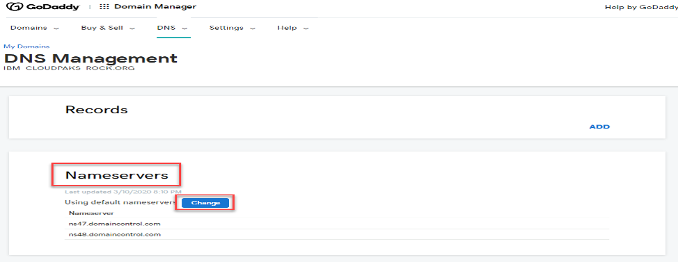
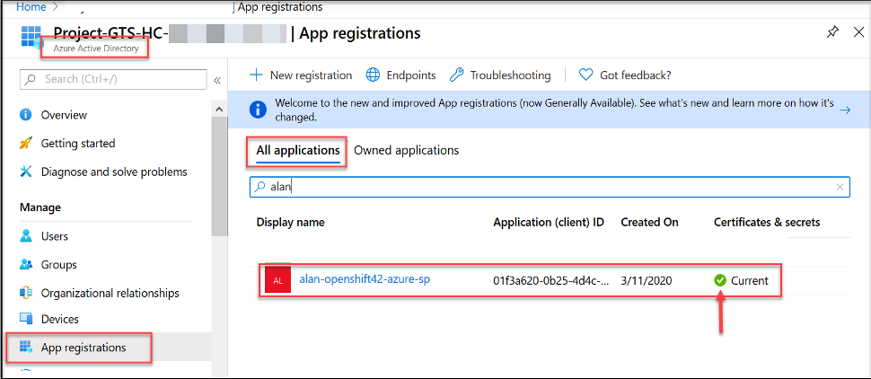

# OCP 4.2 Install on Azure Cloud with Installer-Provisioned Infrastructure (IPI)

This guide covers how to install OCP 4.2 on Azure Cloud using Installer-Provisioned Infrastructure. These steps have been tested with 4.2 but steps may be the same or similar for other OCP 4.x.x versions.

## Prerequisites

Before installation you will need a few things:

* An Azure account with administrative privileges
* A Red Hat account with an OpenShift subscription and access to your pull secret
* A domain name for your cluster to use

### How to Get a Domain Name

RedHat OpenShift will need a domain name to use that is available via your Azure cloud account. 

You can purchase a domain name from a variety of providers. Some popular ones are [GoDaddy](https://www.godaddy.com/domains/domain-name-search) and [Google Domains](https://domains.google/). You can also purchase a domain name via Azure Cloud directly. For more information on that see Microsoft's guide [here](https://docs.microsoft.com/en-us/azure/app-service/manage-custom-dns-buy-domain). This guide uses a domain name from GoDaddy. Regardless of your domain name provider, the process of connecting your domain name to your account is relatively the same.

GoDaddy Example:

</br>  </br>

## Installation

### High-Level Steps

1. Connect your external domain name to your Azure account
   1. Within Azure Portal, create a DNS Zone and Copy Azure name servers
   2. Go to Domain register and add Azure Nameservers
   3. Verify domain has been delegated to Azure with `nslookup` command
2. Download the OpenShift installer, Azure and OpenShift CLIs, and copy your Red Hat pull secret
   1. [Red Hat OpenShift Downloads](https://cloud.redhat.com/openshift/install/azure/installer-provisioned)
   2. [Azure CLI](https://docs.microsoft.com/en-us/cli/azure/install-azure-cli?view=azure-cli-latest)
3. Create an Azure Service Principal and assign permissions (using Azure CLI & Azure portal). Save the output, specifically the **Subscription ID**, the **Azure Tenant ID**, the **Azure Service Principal Client ID**, and the **Azure Service Principal ClientSecret**.
4. Create SSH keys and start SSH agent on the machine you're running the installer from
5. Using `openshift-install` file to configure and install OpenShift (~30-45 minutes)

### High-Level Architecture

</br> </br>

### 1. Connect your External Domain Name

We need to connect your domain name to your Azure account. If you have already done so you can skip this step.

#### Create DNS Zone in Azure  

1.  Go to the Azure portal, search for, and select **DNS Zones**.

</br> </br>

2.  Select + **Add**.

</br> </br>

3.	Select a **Subscription** to create the zone in.

</br></br>

4.  **Resource group** -  Choose a current resource group from drop down or select **“Create new”** to create a new resource group.  The resource group name must be unique within the subscription that you selected.
5.  **Name** - Your domain name. This tutorial uses *ibm-cloudpaks-rock.org*.
6.  Click **“Review + create”**

</br></br>

7.  Click **“Create”**

</br> </br>

8.  Confirm the DNS Zone deployment is successfully where you purchased your Domain name
9.  Select **“Go to resource”**

</br> </br>

10.  Save the **Name servers** to give to your domain name provider.
     -	ns1-06.azure-dns.com.
     -	ns2-06.azure-dns.net.
     -	ns3-06.azure-dns.org.
     -	ns4-06.azure-dns.info.

#### Add Azure DNS Servers to your Domain Provider

This process will be slightly different depending on the provider you used. Here are the steps for GoDaddy.

1. Log in to your domain name provider (GoDaddy, NameCheap, etc).

</br> </br>

2. Navigate to the DNS Management section and look for “Nameservers” to add the Azure DNS names.

</br> </br>

14.  Enter in the Azure DNS host names

</br> </br>

15.  Click "Save” 
16.  Refresh your browser and you should see the Azure DNS host names in the list of Nameservers.

</br> </br>

#### Verify DNS Delegation

You can verify the DNS delegation is working by using `nslookup` to query the Start of Authority (SOA). The SOA record is automatically created when the Azure Zone is created. You may need to wait 10 minutes or more after you complete the delegation for the system to propagate the new dns servers.

1. Open a terminal and type `nslookup -type=SOA your-domain-name-here.com`

</br></br>

*Note*: If you receive output saying it can't find your domain name, try disconnecting any VPNs you may be using.

</br></br>

Once you see azure as the provider, the domain is ready to use.


### 2. Download and Setup Installation Tools

1. Download & Install the [Azure CLI](https://docs.microsoft.com/en-us/cli/azure/install-azure-cli?view=azure-cli-latest)
2. Download the [Red Hat OpenShift Installer](https://cloud.redhat.com/openshift/install/azure/installer-provisioned) for the OS your install machine is using
   1. Alternative [link](https://mirror.openshift.com/pub/openshift-v4/clients/ocp/) for ocp installer

This contains the OpenShift CLI `oc` , the kubernetes cli `kubectl`, and the `openshift-install` installer. You need to keep your pull secret handy as well for later.

*Note:* If you download the installer file to your local desktop and now need to upload them to separate server for the install, you can transfer the file with scp. (command order to use [here](https://linuxize.com/post/how-to-use-scp-command-to-securely-transfer-files/))

3. Untar installer file into a working directory in your PATH. i.e.

    `echo $PATH`

    `sudo mv oc “name of directory”`

    `tar –xvpf openshift-install-linux-4.2.21.tar.gz`

</br> </br>

</br></br>

*Note:* For Windows instructions check out Red Hat's [blog](https://blog.openshift.com/installing-oc-tools-windows/) for exact steps.

4. Verify OpenShift client is in your path by changing to different directory and enter in the command `oc version`

</br></br>

### 3. Create an Azure Active Directory (AAD) Service Principal (SP)

1. Use the Azure CLI to login `az login` and list your account information `az account show`
2. Save your *subscription id* for later

</br> </br>

[**Azure Service Principal**]()


To configure Azure as the Cloud Provider for OpenShift Container Platform, a Service Principal (SP) needs to be created for the installer to use. The Service Principal gives the installer an account to use for automating Azure commands. The easiest way to create this account is via the Azure CLI

1.	Log into Azure via Azure CLI `az login`
2.	Create Service Principal `az ad sp create-for-rbac --name  some-unique-name-sp`
3.	Save the values outputted: **appId**, **password**, and **tenant**

</br></br>

4. Assign the Service Principal the Contributor & User Access Administrator roles in order to properly install OpenShift

   `az role assignment create --assignee APPID_FROM_BEFORE  --role Contributor`
   
   
   `az role assignment create --role "User Access Administrator" --assignee-object-id $(az ad sp list --filter "appId eq '<APPID_FROM_BEFORE>'" | jq '.[0].objectId' -r)`
   

</br></br>

In order to properly mint credentials for components in the cluster, your service principal needs to request for the following application permissions before you can deploy OpenShift on Azure:

 *Azure Active Directory Graph* -> *Application.ReadWrite.OwnedBy*

5. Request permission
   `az ad app permission add -–id APPID_FROM_BEFORE --api 00000002-0000-0000-c000-000000000000  --api-permissions 824c81eb-e3f8-4ee6-8f6d-de7f50d565b7=Role `
   

**The following lines below are skippable for IPI installs currently. Go to 4. Create SSH Keys on the Install Server**

6. Grant permission
   `az az ad app permission grant --id APPID_FROM_BEFORE --api 00000002-0000-0000-c000-000000000000`

</br></br>

**Verify and Grant API Permissions in Azure Portal**


1.	Login into Azure Portal and navigate to `All Services → Azure Active Directory  → App registrations → All Applications`, Then click on your application.

</br></br>

2.	Navigate to API Permissions and verify that you see
    
    **Select** the `“Grant admin consent for ……”` button

</br></br>

 **The following lines above are skippable for IPI installs currently.**


### 4. Create SSH Keys on the Install Server

If you want to perform installation debugging or disaster recovery on your cluster, you must provide an SSH key to both your `ssh-agent` and to the installation program. You can use this key to SSH into the master nodes as the user core. When you deploy the cluster, the key is added to the core user’s `~/.ssh/authorized_keys` list. 

1.	Create SSH Key. Specify the path and file name, such as ~/.ssh/id_rsa, of the SSH key. The below command generates an SSH key that does not require a password in the location that you specify.
    
    `ssh-keygen -t rsa -b 4096 -N  ‘’ -f <path>/<file_name> `

</br></br>

2.	Start the ssh-agent process as a background task:
    
    `eval "$(ssh-agent -s)“ `

</br></br>

3.	Add your SSH private key to the ssh-agent. Specify the path and file name for your SSH private key, such as ~/.ssh/id_rsa
    -	ssh-add <path>/<file_name> 

### 5. Install OpenShift

To begin, you should have the following information saved from previous steps.

</br></br>

#### Create Install Configuration


1.	Navigate to where you downloaded and unpacked the `openshift-install` file
2.	Create a directory for the install, `mkdir ./ocp4`. This directory will hold all the install artifacts, including the initial kubeadmin account
3.	Run the command `./openshift-install create install-config --dir=./ocp4 `. where the directory is the same created in the previous step. This creates the install-config.yaml file. You will be prompted for the following information:
   -	**SSH Public key** – you created when you generated the SSH keys
   -	**Cloud platform** - Azure
   -	**Azure subscription id**
   -	**Azure tenant id**: (this was in the output when you created your service principal)
   -	**Azure service principal client id**: This is the appId from the service principal creation output.
   -	**Azure service principal client secret** – This is the password from the service principal creation output.
   -	**Region**
   -	**Base Domain** – Public domain name you purchased 
   -	**Cluster Name** – Choose a name
   -	**Pull Secret** – you download this from “try.openshift.com along with install & CLI software.

</br></br>

### Custom Install steps

`vi ./ocp4/install-config.yaml`

```
apiVersion: v1
baseDomain: test-cpat-cloudpak.com
compute:
- hyperthreading: Enabled
  name: worker
  platform:
    azure:
      type: Standard_F8s_v2
  replicas: 5
controlPlane:
  hyperthreading: Enabled
  name: master
  platform:
    azure:
      type: Standard_F8s_v2
  replicas: 3
```

#### Run OpenShift Installation

With your config file created and ready, run the install command

 `./openshift-install create cluster --dir=./ocp4`

The Install process can take between 25-45 minutes. When the install is finished, you should see “Install Complete!” message along with OpenShift console URL, username, password. Once this completes, you can access your cluster by getting the kubeadmin acccount information. To do this, set the KUBECONFIG environment variable.

`export KUBECONFIG=$HOME/ocp4/auth/kubeconfig`

`oc cluster-info`

</br></br>

</br></br>

That's it! Your cluster is now ready to use.

## Post Installation


### If we want to add managed disks to each vm follow the steps:

- Go to resource groups
- Select the VM (worker/master) 
- On the left hand side, select disks
- Click add data disk
- If there is a managed disk available select that or create a new disk and attach it

### To take down cluster run:
`openshift-install destroy cluster --dir=./ocp4`
